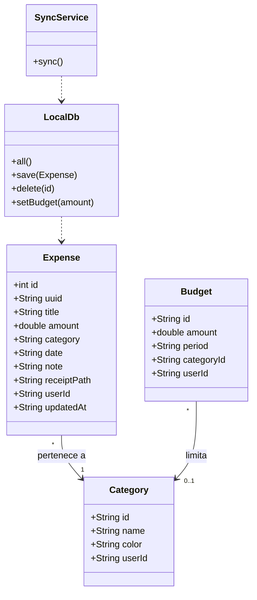
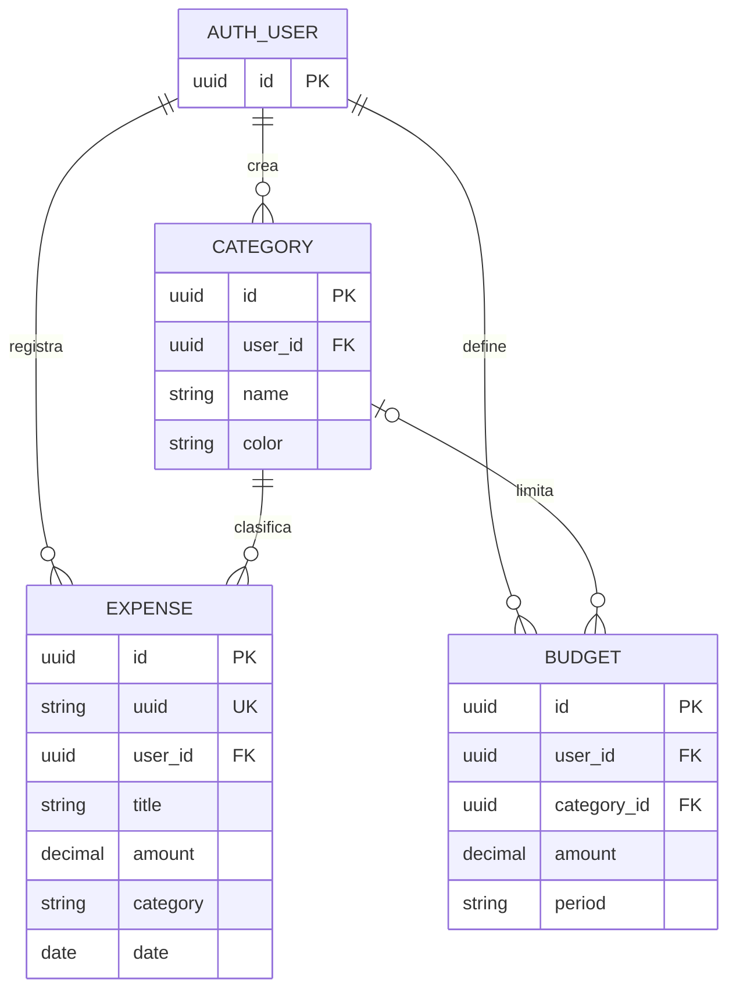

# Diagramas

## Diagrama de clases (Mermaid)

```mermaid
classDiagram
  class Expense {
    +int id
    +String uuid
    +String title
    +double amount
    +String category
    +String date
    +String note
    +String receiptPath
    +String userId
    +String updatedAt
  }
  class Category {
    +String id
    +String name
    +String color
    +String userId
  }
  class Budget {
    +String id
    +double amount
    +String period
    +String categoryId
    +String userId
  }
  class LocalDb {
    +all()
    +save(Expense)
    +delete(id)
    +setBudget(amount)
  }
  class SyncService {
    +sync()
  }
  Expense "*" --> "1" Category : pertenece a
  Budget "*" --> "0..1" Category : limita
  LocalDb ..> Expense
  SyncService ..> LocalDb
```

## Modelo entidad-relación

```mermaid
erDiagram
  AUTH_USER ||--o{ CATEGORY : crea
  AUTH_USER ||--o{ EXPENSE : registra
  AUTH_USER ||--o{ BUDGET : define
  CATEGORY ||--o{ EXPENSE : clasifica
  CATEGORY o|--o{ BUDGET : limita
  AUTH_USER { uuid id PK }
  CATEGORY { uuid id PK uuid user_id FK string name string color }
  EXPENSE { uuid id PK string uuid UK uuid user_id FK string title decimal amount string category date date }
  BUDGET { uuid id PK uuid user_id FK uuid category_id FK decimal amount string period }
```
